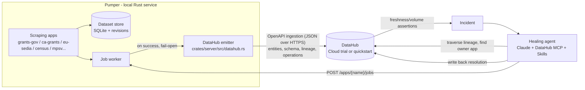

# Pumper × DataHub — Self-Cataloging Scraper Fleet with a Stale-Data Healing Agent

*Hackathon submission draft for [Build with DataHub: The Agent Hackathon](https://datahub.devpost.com/) — track: **Agents That Do Real Work** (with Wildcard flavor).*

## The pitch

**Pumper** is a local-first Rust scraping/data platform: ~20 apps continuously build change-detected datasets from public sources (US federal + California + EU grant opportunities, Czech labour-market statistics, US Census business density, agentic trades research). It already knows a lot about its own data — per-record revision history, field-level diffs, a reactive trigger DAG, run costs — but all of that knowledge is trapped behind a bespoke local API.

This project connects that fleet to **DataHub as its context platform**, in two moves:

1. **Self-cataloging** — Pumper emits a metadata shadow of itself into DataHub on every job run: dataset entities, schemas inferred from real records, **lineage derived from actual run behavior** (e.g. `grants-gov`, `ca-grants`, and `eu-sedia` all feeding the canonical `grants/unified` dataset), row-count profiles, and `operation` freshness events. Data never leaves the local store; only metadata flows.
2. **Healing loop** *(built on the DataHub Cloud trial)* — DataHub **freshness/volume assertions** watch those operation events. When one breaches, an agent (Claude + [DataHub MCP Server](https://docs.datahub.com/docs/features/feature-guides/mcp) + DataHub Skills) reads the incident, traverses lineage to find the owning Pumper app, re-runs it via `POST /apps/{name}/jobs`, verifies the freshness signal recovered, and writes the resolution back to DataHub — so the next person or agent inherits what happened.

The point: data-quality expectations move from hand-written Rust checks inside each app to **declarative assertions any agent can read and act on** — and the repair loop closes without a human.

## Why this is honest engineering (not hackathon theater)

- The lineage is real: three national grant sources with different schemas, currencies, and status vocabularies merge into one canonical dataset with closing-sweeps and cross-source dedup. That merge exists for product reasons; DataHub makes it *visible*.
- The alternative to DataHub assertions is building an assertion DSL, evaluator, and incident model into Pumper — a subsystem we'd be reinventing.
- Emission is fail-open and metadata-only: a down DataHub never touches a job; SQLite remains the single source of truth for data.

## Architecture



## Does the catalog actually make an agent better? We measured it.

Rather than assert that DataHub helps, we ran a controlled A/B on a real downstream consumer of
Pumper's data — **Wellspring**, a grant-writing product whose corpus is mirrored from Pumper's
`opportunities` datasets. Its corpus-analysis agent was run **twice over identical rows**: once with
context hand-carried in the prompt (the status quo — a markdown vault), once reading context from
DataHub. Three slices, six Sonnet runs, one variable, blind-judged by a separate Opus model.

| Metric | Prompt-carried context | DataHub context |
| --- | --- | --- |
| Verdict-schema pass | 3/3 | 3/3 |
| **Deviation from the deterministic scorer's own rubric** (15 scores) | 16.9 | **5.1** |
| Fabricated / pseudo record ids | **0** | 2 |
| Output tokens | **311.9k** | 349.7k (+12%) |
| Blind judge, per slice | 1 win | **1 win, 1 tie** |

The catalog's decisive advantage was **consistency with the system's own definitions**: publishing
the scoring rubric as documented fields on a `source_quality` dataset made the agent's scores line
up with the deterministic scorer it is audited against — exactly matching the two criteria with
crisp published formulas on all three slices, where the control arm drifted on every one. The blind
judge also rated the catalog arm stronger on *mechanism-level* findings (it named **why** a tag
misfires, not just that it does).

Both arms independently surfaced two genuine, previously undocumented data bugs — and **both are now
fixed in the product**, which is the part that matters:

- **EU awards were stamped `USD` while denominated in EUR** — 599 rows re-stamped, USD pair
  recomputed, so a €7M Horizon call values at $7.56M instead of $7M.
- **A `rural` keyword mistagged rural-health / rural-housing / opioid-response grants as
  agriculture** — the agriculture slice shrank 67 → 51 rows (−24%) once corrected.

The findings, their fixes, and the measured effect were **written back into the catalog** (marked
*FIXED … do not re-report*), so the next agent inherits the resolution rather than re-discovering a
closed bug. Full method, results, and honest limitations (n=3, partial blinding, hand-ported
documentation): [`docs/data-analysis/ab-datahub-2026-07-23.md`](../grant-writing-nonprofits/docs/data-analysis/ab-datahub-2026-07-23.md) in the Wellspring repo.

## What's implemented today

- **`[datahub]` config** (`config.toml`): `gms_url`, `token` (or `DATAHUB_TOKEN` in `.env`), URN environment, schema/profile toggles. Off by default.
- **Emitter** (`crates/server/src/datahub.rs`): pure aspect builders (unit-tested) + fail-open emission over `POST {gms}/openapi/entities/v1/` — no Python SDK, no Kafka. Aspects: `datasetProperties` (with run counts as custom properties), `schemaMetadata` (inferred from the newest record), `datasetProfile`, `operation`, `upstreamLineage` (derived from same-run cross-namespace writes).
- **Worker hook**: every succeeded job emits its touched datasets + lineage, detached from the job outcome.
- **API**: `POST /datahub/sync` (one-shot backfill of all datasets — run it once after connecting an instance) and `GET /datahub/status` (config + last emission outcome).
- Reference: [docs/features/datahub.md](docs/features/datahub.md).

## Quickstart

```bash
# 1. Point Pumper at a DataHub instance (Cloud trial or docker quickstart)
#    config.toml:
#      [datahub]
#      enabled = true
#      gms_url = "https://<tenant>.acryl.io/gms"   # or http://localhost:8080
#    .env:
#      DATAHUB_TOKEN=<personal access token>

# 2. Run Pumper and backfill the catalog
#    (--bin pumper is required: the package also ships reindex + search-backfill)
cargo run -p pumper-server --bin pumper      # or: just run
curl -X POST http://localhost:8088/datahub/sync

# 3. Run any app — its run emits fresh metadata + lineage automatically
curl -X POST http://localhost:8088/apps/grants-gov/jobs -d '{}'
curl http://localhost:8088/datahub/status
```

Then in DataHub: search `grants` → open `grants.unified` → Lineage tab shows the three source apps' datasets feeding it; the Properties tab carries last-run new/changed/removed counts; Operations feed the freshness signal.

## Roadmap (hackathon scope remaining)

- [x] Verify aspect ingestion against a live instance — done 2026-07-23 on the local docker quickstart (v1.6): all aspects accepted on the v1 route, three-source lineage on `grants.unified` confirmed via GMS readback.
- [x] Catalog a real downstream consumer (Wellspring: 11 corpus datasets + 70 analysis slices + a rubric dataset) with cross-system lineage `pumper.<app>.opportunities → wellspring.corpus.<source>.<market> → slice.…`, and A/B-measure whether it improves agent analysis — done 2026-07-23.
- [ ] Declare freshness assertions on the grant datasets (daily cadence, tolerating one missed run — mirroring Pumper's own `GET /catalog/health` grace policy).
- [ ] Healing agent: Claude + DataHub MCP server + `datahub-quality` skill; incident → lineage → owning app → re-run → verify → write-back.
- [ ] Model external upstreams (`catalog/data-sources.toml` — grants.gov, SEDIA, Census APIs…) as DataHub entities so lineage reaches true origin.
- [ ] `examples/` folder with emitted metadata payloads + an agent transcript; demo video.

## Submission checklist

- [ ] Public repo + **Apache 2.0 LICENSE** visible in the About section
- [ ] Live demo URL or repo with setup instructions (this file)
- [ ] Text description (this file's pitch)
- [ ] < 3 min demo video (YouTube/Vimeo, public)
- [ ] Sample outputs in `examples/`
